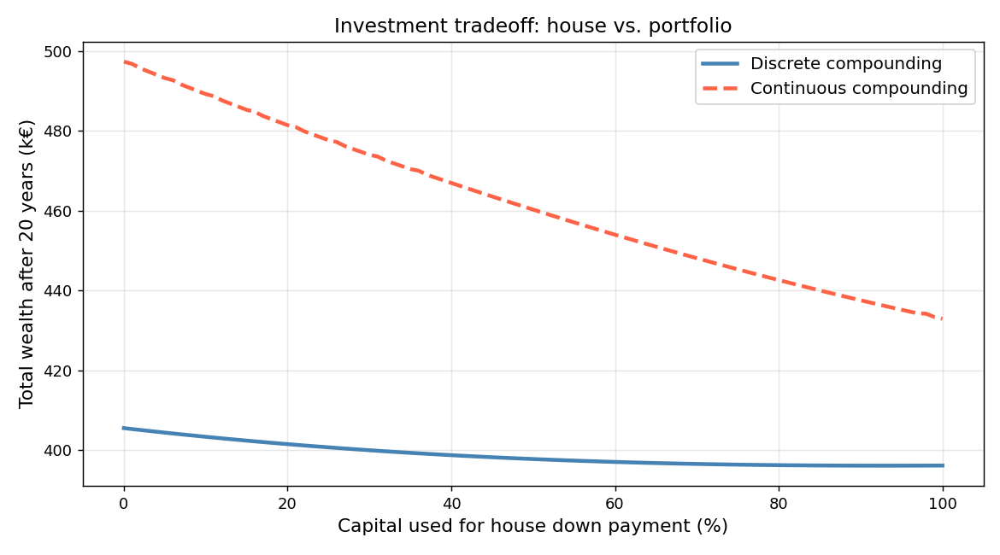

# Investment Simulator

Interactive Bokeh dashboards exploring financial tradeoffs between house ownership and portfolio investing.



---

## Overview

Given an initial capital, a salary, and a target house price, how much of your capital should go toward the down payment — and how much should stay invested?

These scripts model two financial phases:
1. **Loan repayment** — you pay annual fees on the outstanding loan while saving.
2. **Post-loan** — no more fees; full salary + savings compound into your portfolio.

The **investment rate** (`alpha`) controls what fraction of your initial capital is used as the down payment. A higher alpha means a smaller loan (fewer fees) but less capital working for you from day one.

---

## Scripts

| Script | Description | Output |
|---|---|---|
| `bokeh_script.py` | Tradeoff curve: total wealth vs. investment rate (discrete) | `output/investment_tradeoff.html` |
| `bokeh_script_cont.py` | Same, with continuous compounding | `output/investment_tradeoff_continuous.html` |
| `bokeh_timeline.py` | Wealth over time — capital, dividends, total (discrete) | `output/investment_temporal.html` |
| `bokeh_timeline_continuous.py` | Same, with continuous compounding | `output/investment_temporal_continuous.html` |
| `car_insurance.py` | Car insurance strategy comparison (matplotlib) | `output/car_insurance.png` |
| `generate_preview.py` | Regenerate `assets/preview.png` for this README | `assets/preview.png` |

---

## Usage

```bash
pip install -r requirements.txt

# Interactive Bokeh dashboards (open in browser)
python3 bokeh_script.py
python3 bokeh_script_cont.py
python3 bokeh_timeline.py
python3 bokeh_timeline_continuous.py

# Static matplotlib plots
python3 car_insurance.py
python3 generate_preview.py
```

---

## Financial Model

All investment scripts share the same core parameters (adjustable via spinners in the HTML output):

| Parameter | Description |
|---|---|
| `alpha` | Fraction of initial capital used as house down payment |
| Capital at t=0 | Initial savings (k€) |
| House price | Target property price (k€) |
| Salary per year | Annual income used to repay the loan |
| Saving per year | Amount saved on top of loan repayment |
| Loan fee (%) | Annual interest rate on the outstanding loan |
| Dividend rate (%) | Annual return on invested capital |

The vertical dashed line in timeline plots marks **t₁**, the year the loan is fully repaid — the point where wealth accumulation noticeably accelerates.
