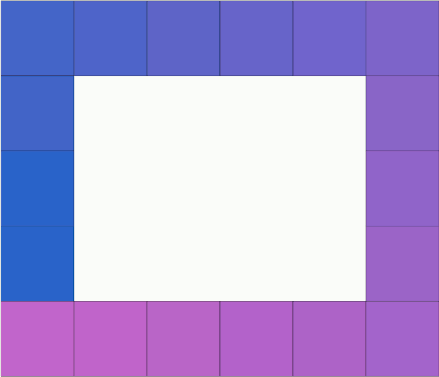

# LED simulator

If you play with Arduino and addressable LED strips, you may want to simulate first what your LED program would do.

Here, you need to transcript your arduino LED coloring code into python code.




## Examples


### Strip Simulator

You need to specify the number of LED you want (here 34).

`bokeh serve LED_simulator.py --args line 34`

LED organisation

`A B C D`

### Matrix Simulator

`bokeh serve LED_simulator.py --args matrix 16 10`

Matrix organisation:

```txt
I J K L
H G F R
A B C D
```

### Border Simulator


If you need to change the coloring file location or the delay (main parser arguments), you should specify them BEFORE the line/matrix/border argument.


`bokeh serve LED_simulator.py --args --delay=10 border 20 12`


Border organization:

```txt
I H G F
J     E
A B C D
```

## Customization

You should create your own file that should implement at least one of these function:

- `create_line(LED)`
- `create_matrix(LED_x, LED_y)`
- `create_border(LED_x, LED_y)`

These function should return another function where given a timestamps `t`, the function returns an `n x 3` int array, where these values would be converted to colors.

(check `my_coloring_template.py` for an example).

Here, the function are stateless.
You can modify the script to have something recording the previous state rather than using delay.


# Technics

- [x] Bokeh serve
- [x] `argparse` + bokeh 
- [x] `periodic_callback()`
- [x] Load a custom module using the absolute path (without using `from xxx import yyy`)

